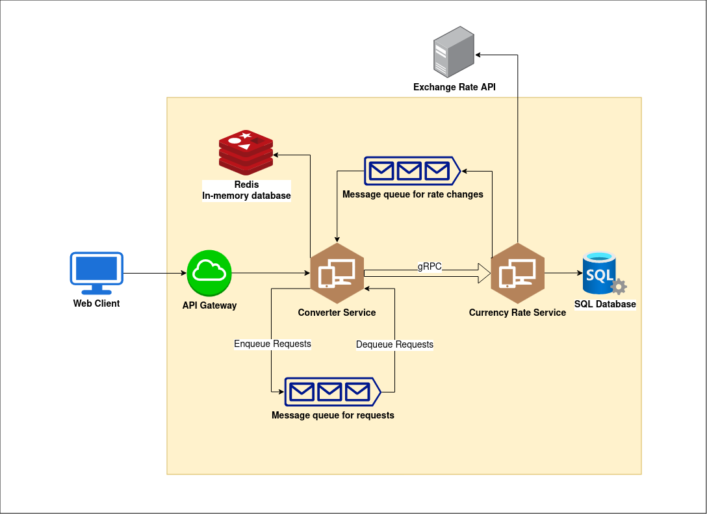

# Sharp Currency Converter

## Description
A currency converter application built using microservices and event-driven architecture.

## System Design

### Architecture Diagram

Below is the system architecture diagram that illustrates the main components and their interactions:

### Components

There are three main components:

+ **Currency Rate Service**: Responsible for retrieving the latest exchange rates from a provider, specifically from [ExchangeRate-API](https://app.exchangerate-api.com/).

+ **Converter Service**: This service retrieves the processed rates from the **Currency Rate Service** using **gRPC** if the rate data is not available in the in-memory database **Redis**. It then uses the retrieved exchange rates for conversion and returns the result to users.

+ **Web Client**: A compact web application that allows users to convert any amount of supported currencies into another.

Other Components:
+ **NGINX** as an API gateway.
+ **RabbitMQ** as a message queue for incoming requests and another for rate changes from the **Currency Rate Service**.
+ **SQL Server** as a database for currency rates.
+ **Redis** as a cache storage for recently requested exchange rates.
+ Rate limiters will also be applied where relevant.

All the components will be deployed using **Docker Compose**.